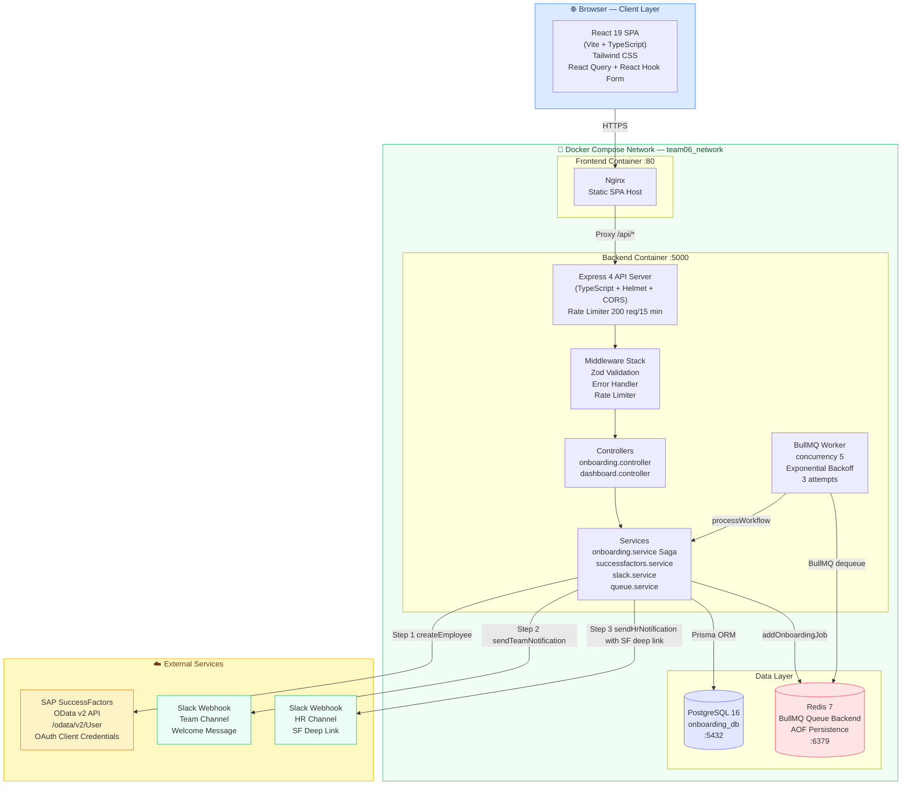
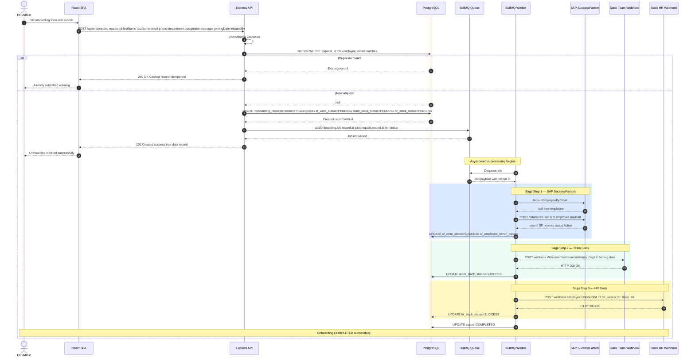
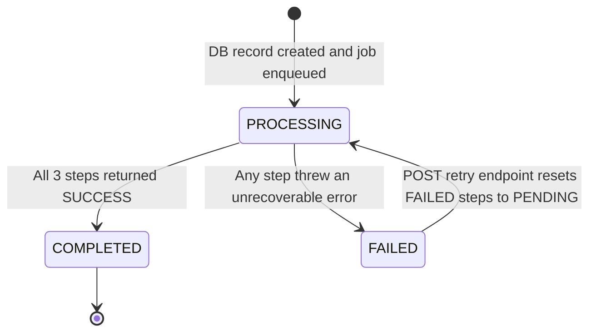
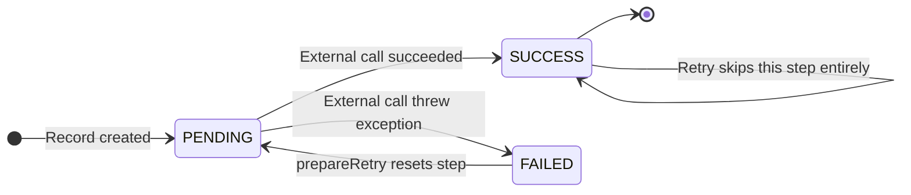
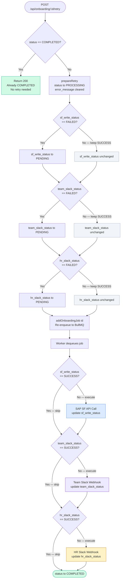
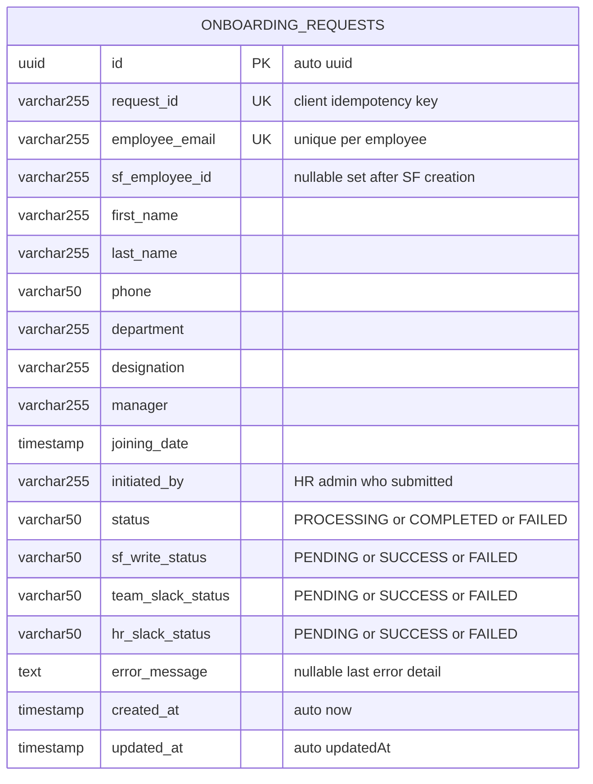

# Architecture — Employee Onboarding Automation Platform

> **INTEGRTR × LPU Hackathon 2026 — Team 06**
> *Full-Stack SAP SuccessFactors Onboarding Workflow Engine*

---

## Table of Contents

1. [System Overview](#1-system-overview)
2. [Full-Stack Architecture Diagram](#2-full-stack-architecture-diagram)
3. [Onboarding Workflow — Sequence Diagram](#3-onboarding-workflow--sequence-diagram)
4. [Saga Pattern — State Diagram](#4-saga-pattern--state-diagram)
5. [Retry Flow Diagram](#5-retry-flow-diagram)
6. [Database — ER Diagram](#6-database--er-diagram)
7. [Component Descriptions](#7-component-descriptions)
8. [API Reference](#8-api-reference)
9. [Technology Stack](#9-technology-stack)

---

## 1. System Overview

The **Employee Onboarding Automation Platform** is a full-stack web application built for the INTEGRTR × LPU Hackathon 2026 by **Team 06**. It automates the multi-step process of onboarding a new employee by orchestrating integrations with **SAP SuccessFactors** (HRIS) and **Slack** (team communications) through a durable, fault-tolerant workflow engine.

### Core Goals

| Goal | Implementation |
|------|---------------|
| **Zero data loss** | Every onboarding request is persisted to PostgreSQL before any external call is made |
| **Idempotency** | Duplicate submissions (by `request_id` or `employee_email`) are detected and safely deduplicated at the DB layer before job queuing |
| **Fault tolerance** | Each integration step persists its own success/failure status; failed jobs can be retried without re-executing already-successful steps |
| **Observability** | Structured `winston` logging with per-step saga state visible on the dashboard |
| **Scalability** | Asynchronous BullMQ worker queue decouples HTTP request handling from long-running integration calls |

### High-Level Data Flow

```
HR Admin fills onboarding form in React SPA
    ↓
POST /api/onboarding (Express + Zod validation + Rate Limiter)
    ↓
Idempotency check against PostgreSQL
    ↓
DB record created (status: PROCESSING, all steps: PENDING)
    ↓
Job enqueued on BullMQ (Redis-backed)  ← HTTP response 201 returned immediately
    ↓
BullMQ Worker picks up job (concurrency: 5)
    ↓
Saga Step 1 → SAP SuccessFactors OData API  (sf_write_status)
Saga Step 2 → Team Slack Webhook             (team_slack_status)
Saga Step 3 → HR Slack Webhook               (hr_slack_status)
    ↓
status → COMPLETED  (all steps SUCCESS)
```

The platform supports **mock mode** for both SAP SuccessFactors and Slack, allowing full end-to-end demonstration without live credentials. Failure injection is supported by convention on the employee email address (e.g., `fail-sf@test.com`, `fail-slack-team@test.com`).

---

## 2. Full-Stack Architecture Diagram



---

## 3. Onboarding Workflow — Sequence Diagram

This diagram traces the complete lifecycle of a single onboarding submission from form submit through saga completion.



---

## 4. Saga Pattern — State Diagram

Each onboarding request is orchestrated as a **Choreography-less Saga** — a sequential series of steps where each step's outcome is persisted to the database immediately. This makes the saga resumable without re-running succeeded steps.

### Overall Request Status



### Per-Step Status Lifecycle

Applies individually to `sf_write_status`, `team_slack_status`, and `hr_slack_status`.



### Step Execution Guard Logic

The saga processor checks each step's persisted status before executing it. This is the core idempotency guarantee within the workflow:

```typescript
// Step is skipped entirely if it already succeeded
if (request.sf_write_status !== 'SUCCESS') {
    // ... execute Step 1 — SAP SuccessFactors
}
if (request.team_slack_status !== 'SUCCESS') {
    // ... execute Step 2 — Team Slack
}
if (request.hr_slack_status !== 'SUCCESS') {
    // ... execute Step 3 — HR Slack
}
// All steps passed → mark COMPLETED
```

---

## 5. Retry Flow Diagram

When a workflow fails partway through, the **Retry Center** UI page calls `POST /api/onboarding/:id/retry`. The `prepareRetry()` service method resets only the `FAILED` steps back to `PENDING` while preserving `SUCCESS` steps. The job is then re-enqueued and the saga resumes from the first non-`SUCCESS` step.



### BullMQ Built-in Retry vs. Saga Retry

| Mechanism | Trigger | Behaviour |
|-----------|---------|-----------|
| **BullMQ job retry** (automatic) | Worker throws an exception | Re-runs the entire worker handler up to 3 times with exponential backoff (initial delay: 5 s). Saga guards prevent re-executing `SUCCESS` steps. |
| **Manual saga retry** (UI-triggered) | `POST /api/onboarding/:id/retry` | Explicitly resets only `FAILED` step statuses to `PENDING`, then re-enqueues the job. |

---

## 6. Database — ER Diagram

The application uses a single primary table `onboarding_requests`, managed via **Prisma ORM** with PostgreSQL 16.



### Field Semantics

| Field | Purpose |
|-------|---------|
| `id` | Internal UUID primary key used by the BullMQ job and all internal lookups |
| `request_id` | Client-supplied idempotency key (UUID generated on the frontend before submit). Prevents duplicate processing on network retries. |
| `employee_email` | Unique constraint ensures no employee can be onboarded twice, even with a different `request_id` |
| `sf_employee_id` | Populated after successful SAP SuccessFactors employee creation; used to generate the HR Slack deep link (`/sf/liveprofile?username=<sf_employee_id>`) |
| `status` | Top-level workflow status. `PROCESSING` while saga runs, `COMPLETED` when all steps succeed, `FAILED` when any step fails terminally |
| `sf_write_status` | Granular step status for Saga Step 1 — SAP SuccessFactors |
| `team_slack_status` | Granular step status for Saga Step 2 — Team Slack channel |
| `hr_slack_status` | Granular step status for Saga Step 3 — HR Slack channel |
| `error_message` | Last encountered error detail string. Cleared on step success or retry initiation |

---

## 7. Component Descriptions

### 7.1 React Frontend (SPA)

**Path:** `frontend/`  
**Runtime:** Vite Dev Server (dev) / Nginx static host (production, port 80)

The frontend is a single-page application providing the HR administrator interface. It communicates with the backend exclusively via REST API calls using **Axios** wrapped in **TanStack React Query** for automatic caching, loading states, and background refetching.

#### Pages

| Page | Route | Purpose |
|------|-------|---------|
| **Dashboard** | `/` | KPI cards: Total requests, Completed, Failed, Processing counts. Real-time polling. |
| **New Employee** | `/new-employee` | Multi-field onboarding form with full Zod client-side validation. Generates `requestId` UUID on mount. |
| **Workflow History** | `/history` | Paginated table of all onboarding requests with status badges and drill-down links |
| **Employee Details** | `/employee/:id` | Per-request view showing all Saga step statuses, SF Employee ID, and timestamps |
| **Retry Center** | `/retry` | Lists all `FAILED` requests with a one-click Retry button per record |
| **Failure Monitoring** | `/failures` | Focused failure analytics: error messages, failed step breakdown |
| **System Health** | `/health` | Polls `/api/health` — shows DB, Redis, and queue worker connectivity |

#### Key Libraries

- **React 19** — UI framework
- **Vite 8** — Build tool with HMR
- **Tailwind CSS 4** — Utility-first styling
- **React Router DOM 7** — Client-side routing
- **TanStack React Query 5** — Server state management and caching
- **React Hook Form 7 + Zod 4** — Form management and validation
- **Axios 1** — HTTP client
- **Lucide React** — Icon library
- **Sonner** — Toast notifications

---

### 7.2 Express Backend API

**Path:** `backend/src/index.ts`  
**Runtime:** Node.js 20 / TypeScript 5 (compiled to `dist/`) — Port **5000**

The API server is built with **Express 4** and TypeScript. It is the single entry point for all client requests and orchestrates the onboarding workflow via service classes and the BullMQ queue.

#### Middleware Chain (per request)

```
Helmet (security headers)
  → CORS (all origins, configurable)
    → express.json() (body parsing)
      → apiLimiter (200 req / 15 min, per-IP rate limiting)
        → Router (route matching)
          → validate(schema) (Zod middleware)
            → Controller handler
              → errorHandler (global catch-all)
```

#### Route Map

| Method | Path | Handler | Description |
|--------|------|---------|-------------|
| `POST` | `/api/onboarding` | `createRequest` | Submit new onboarding request |
| `GET` | `/api/onboarding` | `getAllRequests` | List all requests (dashboard) |
| `GET` | `/api/onboarding/:id` | `getRequestById` | Get single request detail |
| `POST` | `/api/onboarding/:id/retry` | `retryRequest` | Retry a failed workflow |
| `GET` | `/api/dashboard` | `getDashboardMetrics` | Aggregated KPI counts |
| `GET` | `/api/failures` | `getFailures` | List all FAILED requests |
| `GET` | `/api/health` | `getHealth` | System health check (DB + Redis) |

---

### 7.3 Onboarding Service — Saga Orchestrator

**Path:** `backend/src/services/onboarding.service.ts`

The core domain logic. Implements the **Saga pattern** as a sequential, step-by-step execution function (`processWorkflow`). Each step:

1. Checks if the step's status is already `SUCCESS` — if so, skips it entirely.
2. Calls the relevant external service.
3. On success: updates the step status to `SUCCESS` in the DB.
4. On failure: updates the step status to `FAILED`, sets the overall `status` to `FAILED`, writes the error message, and returns early.

This design means the saga is **idempotent by default** — it can be called multiple times and will always resume from the first non-`SUCCESS` step.

**Key Methods:**

| Method | Description |
|--------|-------------|
| `createOnboardingRequest(input)` | Idempotency check + DB record creation |
| `processWorkflow(id)` | Full saga execution covering Steps 1 through 3 |
| `prepareRetry(id)` | Resets `FAILED` steps to `PENDING`, sets status to `PROCESSING` |
| `getRequestById(id)` | Fetch by UUID |
| `getRequestByEmail(email)` | Fetch by employee email |
| `getAllRequests()` | Ordered list descending by created_at |

---

### 7.4 BullMQ Queue Service — Async Worker

**Path:** `backend/src/services/queue.service.ts`

Manages the **`onboarding-queue`** — a Redis-backed BullMQ queue that decouples HTTP request handling from the long-running saga execution. The API responds with **201** immediately after enqueuing; the saga runs asynchronously in the worker.

**Configuration:**

| Parameter | Value |
|-----------|-------|
| Queue name | `onboarding-queue` |
| Job ID | Set to `record.id` (prevents duplicate jobs via BullMQ native job ID dedup) |
| Max attempts | 3 |
| Backoff strategy | Exponential, initial delay: 5,000 ms |
| Worker concurrency | 5 simultaneous jobs |
| `removeOnComplete` | `true` (successful jobs cleaned from Redis) |
| `removeOnFail` | `false` (failed jobs retained for inspection) |

---

### 7.5 SAP SuccessFactors Service

**Path:** `backend/src/services/successfactors.service.ts`

Abstracts all communication with the **SAP SuccessFactors OData v2 API**. Supports both **live mode** (real OAuth credentials) and **mock mode** (`SF_MOCK_MODE=true`).

**Live Mode Flow:**
1. `getAccessToken()` — POST to `/oauth/token` with `client_credentials` grant type.
2. `lookupEmployeeByEmail(email)` — GET `/odata/v2/User` with `$filter=email eq '...'` to prevent double-creation.
3. `createEmployee(input)` — POST `/odata/v2/User` with OData payload.

**Mock Failure Injection** (via employee email convention):

| Email Contains | Injected Error |
|----------------|---------------|
| `fail-sf` | 500 Internal Server Error |
| `timeout-sf` | Network / Timeout Error |
| `429-sf` | Rate Limit Exceeded |
| `401-sf` | Authentication / Authorization Failed |
| `existing` | Employee already exists — lookup returns SF_999999 |

**Error Handling:** All Axios errors are translated to typed domain errors by `handleAxiosError()`, mapping HTTP status codes (401, 403, 404, 429, 5xx) to specific descriptive error messages.

---

### 7.6 Slack Service

**Path:** `backend/src/services/slack.service.ts`

Posts formatted messages to two separate Slack Incoming Webhook URLs. Supports both **live mode** and **mock mode** (`SLACK_MOCK_MODE=true`).

#### Message Templates

**Team Channel (Step 2):**
```
[Team 06]
Welcome {firstName} {lastName}
Department: {department}
Joining Date: {joiningDate — long format}
```

**HR Channel (Step 3):**
```
[Team 06]
Employee Onboarded
Employee ID: {sf_employee_id}
Department: {department}
Joining Date: {joiningDate — long format}
SuccessFactors Link: {SF_API_URL}/sf/liveprofile?username={sf_employee_id}
```

**Mock Failure Injection** (via employee email convention):

| Email Contains | Channel | Injected Error |
|----------------|---------|---------------|
| `fail-slack-team` | Team | Slack connection timeout |
| `fail-slack-hr` | HR | Slack Server Error 500 |

---

### 7.7 PostgreSQL — Data Persistence

**Image:** `postgres:16-alpine`  
**Port:** 5432 internal to Docker network, mapped to host  
**ORM:** Prisma 5 with auto-generated TypeScript client  
**Persistence:** Docker named volume `postgres_data` (survives container restarts)

The database serves three roles:
- **Record of truth** for all onboarding requests and their step statuses
- **Idempotency lock** — the `UNIQUE` constraints on `request_id` and `employee_email` prevent concurrent duplicate processing
- **Audit trail** — `created_at` and `updated_at` timestamps on every record

---

### 7.8 Redis — Queue Backend

**Image:** `redis:7-alpine`  
**Port:** 6379 internal, mapped to host  
**Persistence:** AOF (`--appendonly yes`) + Docker named volume `redis_data`  
**Client:** `ioredis` 5 (used by BullMQ internally)

Redis stores:
- **Queued jobs** pending pickup by the BullMQ worker
- **Failed jobs** (retained for inspection, `removeOnFail: false`)
- **Job metadata** including attempt counts, timestamps, and error reasons

The health check endpoint (`GET /api/health`) pings Redis to confirm connectivity.

---

## 8. API Reference

### POST `/api/onboarding`

Submit a new employee onboarding request.

**Request Body:**

```json
{
  "requestId": "550e8400-e29b-41d4-a716-446655440000",
  "firstName": "Jane",
  "lastName": "Smith",
  "email": "jane.smith@company.com",
  "phone": "+91-9876543210",
  "department": "Engineering",
  "designation": "Software Engineer",
  "manager": "John Doe",
  "joiningDate": "2026-07-01T00:00:00.000Z",
  "initiatedBy": "hr.admin@company.com"
}
```

**Responses:**

| Status | Condition | Body |
|--------|-----------|------|
| `201 Created` | New request, job queued | `{ success: true, message: "...", data: OnboardingRequest }` |
| `200 OK` | Duplicate request (idempotent) | `{ success: true, message: "Request already exists...", data: OnboardingRequest }` |
| `400 Bad Request` | Zod validation failure | `{ success: false, error: [...] }` |
| `429 Too Many Requests` | Rate limit exceeded | Express rate limit response |

---

### GET `/api/onboarding`

Retrieve all onboarding records, ordered by creation date descending.

**Response:** `{ success: true, data: OnboardingRequest[] }`

---

### GET `/api/onboarding/:id`

Retrieve a single onboarding record by UUID.

**Response:** `{ success: true, data: OnboardingRequest }` or `404` if not found.

---

### POST `/api/onboarding/:id/retry`

Retry a failed onboarding workflow. Resets only `FAILED` steps to `PENDING`, preserves `SUCCESS` steps, and re-enqueues the job.

**Responses:**

| Status | Condition |
|--------|-----------|
| `200 OK` | Retry initiated or already COMPLETED (no-op) |
| `404 Not Found` | Record with given ID does not exist |

---

### GET `/api/dashboard`

Returns aggregated KPI counts: total, completed, failed, and processing request counts.

---

### GET `/api/failures`

Returns all onboarding records where `status = 'FAILED'`, including error messages and per-step statuses.

---

### GET `/api/health`

Returns system health status including PostgreSQL and Redis connectivity checks.

---

## 9. Technology Stack

### Backend

| Category | Technology | Version | Role |
|----------|-----------|---------|------|
| Runtime | Node.js | 20 LTS | JavaScript runtime |
| Language | TypeScript | 5.4 | Static typing |
| Framework | Express | 4.19 | HTTP server and routing |
| ORM | Prisma | 5.12 | Database access and migrations |
| Queue | BullMQ | 5.7 | Async job queue |
| Redis Client | ioredis | 5.4 | BullMQ transport layer |
| Validation | Zod | 3.22 | Schema validation (server) |
| HTTP Client | Axios | 1.6 | External API calls (SF, Slack) |
| Security | Helmet | 7.1 | HTTP security headers |
| Security | CORS | 2.8 | Cross-origin resource sharing |
| Rate Limiting | express-rate-limit | 7.2 | API abuse prevention |
| Logging | Winston | 3.13 | Structured logging |
| Testing | Jest + Supertest | 29.7 | Unit and integration tests |

### Frontend

| Category | Technology | Version | Role |
|----------|-----------|---------|------|
| Framework | React | 19 | UI framework |
| Language | TypeScript | 6.0 | Static typing |
| Build Tool | Vite | 8 | Dev server and bundler |
| Styling | Tailwind CSS | 4 | Utility-first CSS |
| Routing | React Router DOM | 7 | Client-side routing |
| Server State | TanStack React Query | 5 | API caching and synchronisation |
| Forms | React Hook Form | 7 | Form state management |
| Validation | Zod | 4 | Client-side schema validation |
| HTTP Client | Axios | 1.18 | API calls |
| Icons | Lucide React | 1.21 | Icon set |
| Toasts | Sonner | 2 | Notification toasts |

### Infrastructure

| Category | Technology | Version | Role |
|----------|-----------|---------|------|
| Database | PostgreSQL | 16-alpine | Primary data store |
| Cache / Queue | Redis | 7-alpine | BullMQ job persistence |
| Web Server | Nginx | alpine | Frontend static host |
| Containerisation | Docker Compose | v3.9 | Service orchestration |

### External Integrations

| Service | Protocol | Endpoint Pattern | Auth |
|---------|----------|-----------------|------|
| SAP SuccessFactors | OData v2 over HTTPS | `/odata/v2/User` | OAuth 2.0 Client Credentials |
| Slack Team Channel | HTTPS Webhook | Incoming Webhook URL | URL-embedded token |
| Slack HR Channel | HTTPS Webhook | Incoming Webhook URL | URL-embedded token |

---

## Appendix — Environment Variables

| Variable | Required | Default | Description |
|----------|----------|---------|-------------|
| `DATABASE_URL` | Yes | — | PostgreSQL connection string |
| `REDIS_URL` | Yes | — | Redis connection string |
| `PORT` | No | `5000` | Express server port |
| `NODE_ENV` | No | `development` | Runtime environment |
| `SF_API_URL` | Yes | — | SAP SuccessFactors base URL |
| `SF_CLIENT_ID` | Yes (live) | — | OAuth client ID |
| `SF_PRIVATE_KEY` | Yes (live) | — | OAuth private key |
| `SF_MOCK_MODE` | No | `true` | Enable mock SF integrations |
| `SLACK_WEBHOOK_TEAM` | Yes (live) | — | Team channel webhook URL |
| `SLACK_WEBHOOK_HR` | Yes (live) | — | HR channel webhook URL |
| `SLACK_MOCK_MODE` | No | `true` | Enable mock Slack integrations |
| `RATE_LIMIT_MAX` | No | `200` | Max requests per window |
| `RATE_LIMIT_WINDOW_MS` | No | `900000` | Rate limit window in milliseconds |

---

*Document maintained by Team 06 — INTEGRTR × LPU Hackathon 2026*  
*Last updated: 2026-06-22*
